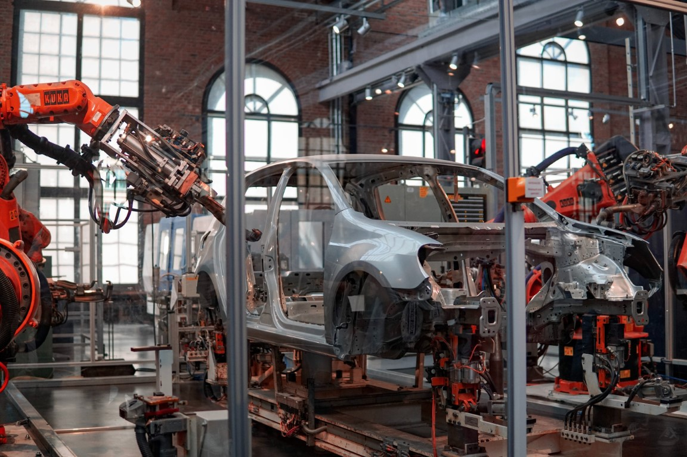

[toc]

## Robots and Supervisors

You're the boss of a car factory. Your cars are made on a robotic assembly line. Each robot performs a function, adding or changing parts, and passes the unfinished car to the next robot. Normally you end up with a shiny new car at the end, but you have a problem. Sometimes the car parts going into the assembly line aren't perfect, so the robots mess up. If the first robot messes up, the second robot tries to work on the defective car and breaks. Then the third robot tries and also breaks. Pretty soon your whole assembly line is broken. 

You decide to hire Mr. M. Monad, a strongman, to supervise your robots. Now, when a robot messes up, M. Monad dashes in and tosses the deformed car off the assembly line. This way your robots aren't broken, and can try again from the beginning. M. Monad reports every failure to you, but unfortunately he enjoys tossing cars too much and never notices why the robot messed up. This won't do, so you hire M. Monad's brother, E. Monad , who is just as strong, but a little more attentive. After tossing a car, Mr. E. Monad makes sure to write down why the robot messed up. Now you can fix your assembly line!

[^robot-assembly]

It turns out the entire Monad family has been training to be supervisors since they were little. They are very good at following cars down assembly lines and supervising robots, so you decide to hire more Monads to solve your problems. Specifically, one assembly line keeps making cars with the same minor defects each time. E. Monad doesn't notice because the defects aren't obvious, but he recommends you hire his mother, W. Monad, who is always telling him to pay more attention to detail. As the unfinished car moves down the assembly line, W. Monad writes down in her log what each robot does. At the end, she gives the log to you. You read the logs and discover how to fix the robots so they do a perfect job.

Your factory has become so successful that some of your customers want to order custom cars. For this job, W. Monad recommends her sister R. Monad. R. Monad tends to procrastinate to the last second, but you hire her anyway. As the car moves down the assembly line, R. Monad follows and gives a copy of the custom order details to each robot. This way each robot behaves differently to create the custom car.

Now, you can rest easy knowing your assembly lines are running smoothly with the help of the Monads.

## Credits
|               |                    |
| ------------: | :----------------- |
| Car Being Assembled | Data               |
| Robot Behavior | Functions          |
| Assembly Line | Chain of functions |
|      M. Monad | Maybe Monad        |
|      E. Monad | Either Monad       |
|      W. Monad | Writer Monad       |
|      R. Monad | Reader Monad       |
|       The Boss, You | The Programmer     |

## Meta

Every monad tutorial has to have some words about monad tutorials. I won't break tradition here. I wrote this tutorial to focus on the overall intuition around monads. Monads have been compared to assembly lines before but I found the analogies on the complex side. This version isn't an exact analogy, but I feel it's much more understandable. Hopefully this gave you an intuition of monads and what they do.

I classified this article as an Article; a constant work in progress, so if you have suggestions, please tell me!

[^robot-assembly]: [Photo](https://unsplash.com/photos/jHZ70nRk7Ns) by [Lenny Kuhne](https://unsplash.com/@lennykuhne?utm_source=unsplash&utm_medium=referral&utm_content=creditCopyText) on [Unsplash](https://unsplash.com/?utm_source=unsplash&utm_medium=referral&utm_content=creditCopyText)

