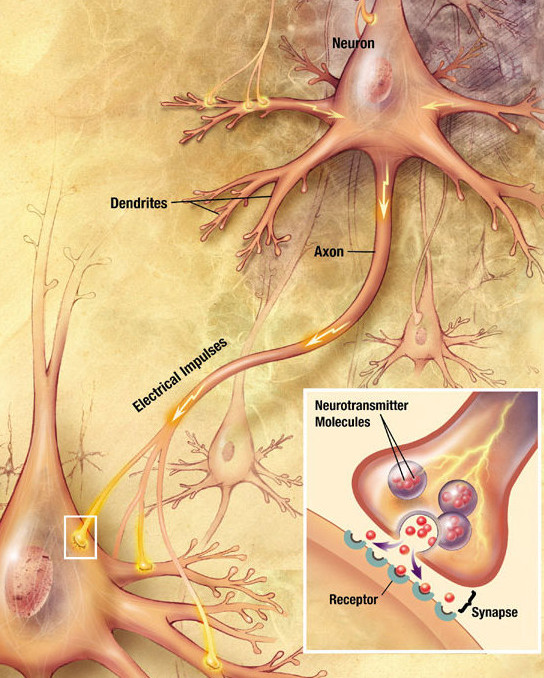

Neurons and glia have an intimate relationship oft ignored by researchers. In this introductory article, I hope to illuminate a lesser-known field of research and elucidate its relevance to artificial intelligence. 

## Introduction

In the human brain, glia and neurons have a nearly one-to-one ratio.[^vonBartheld2018] In the cerebral cortex, however, glia outnumber neurons about 1.5-to-1, and larger brains tend to have higher glia-to-neuron ratios.[^Herculano-Houzel2014] Greek for glue, glia are found everywhere in the nervous system. [Oligodendrocytes](https://en.wikipedia.org/wiki/Oligodendrocyte) and [Schwann cells](https://en.wikipedia.org/wiki/Schwann_cell) wrap neurons' [axons](https://en.wikipedia.org/wiki/Axon) in the [central nervous system](https://en.wikipedia.org/wiki/Central_nervous_system) (CNS) and [peripheral nervous system](https://en.wikipedia.org/wiki/Peripheral_nervous_system) (PNS), respectively. This insulation, or [myelination](https://en.wikipedia.org/wiki/Myelin) allows for higher speeds of signal transmission. [Astrocytes](https://en.wikipedia.org/wiki/Astrocyte) perform many actions affecting neural networks, such as fueling neurons, modulating synaptic transmission, and physically moving around. There are many other types and sub-types of glial cells, but I'll be focusing primarily on astrocytes.

 <figcaption>Astrocyte stained with antibodies to GFAP (red) and vimentin (green)[^astrocyte-gerryshaw]</figcaption>

## Synapses

The word astrocyte comes from astron (ἄστρον) in Greek, meaning star, and the rays emanating from an astrocyte connect to neurons and blood vessels. In particular, astrocytes play a major role at the connection between neurons, the [synapse](https://en.wikipedia.org/wiki/Synapse). At a synapse, presynaptic neurons release neurotransmitters into a gap called the synaptic cleft, and these neurotransmitters attach to receptors on the postsynaptic neuron, changing its electrical properties. 

The mechanism for releasing neurotransmitters depends on calcium (Ca^2+^). Ca^2+^ is incredibly important to the function of neurons and astrocytes (more on the astrocytes later). When a neuron fires, the voltage change causes voltage-gated Ca^2+^ channels to open, leading to an influx of Ca^2+^. This triggers the neurotransmitter containers, [synaptic vesicles](https://en.wikipedia.org/wiki/Synaptic_vesicle), to fuse with the cell membrane and release their neurotransmitters. 

[^synapse-picture] 

Now that we know the basics of synapses, I'll begin with an extremely well-cited paper reviewing what we knew about the role of glial cells in 1999, called "Tripartite synapses: glia, the unacknowledged partner".[^tripartite1999]

## The Tripartite Synapse

What does tripartite synapse refer to? Originally the term "bipartite" referred to the presynaptic and postsynaptic neurons. A tripartite synapse thus implies a third connection, that with glia. Biologically, this is what we typically see — a presynaptic neuron, a postsynaptic neuron, and an astrocyte connected to each other. For example, at [excitatory synapses](https://en.wikipedia.org/wiki/Excitatory_synapse), astrocytes regulate glutamate reuptake from the synaptic cleft. Furthermore, the tripartite synapse paper shows several other ways glia interact with neurons.

Through [gliotransmitters](https://en.wikipedia.org/wiki/Gliotransmitter), astrocytes not only signal neurons, but also other astrocytes. When Ca^2+^ levels in astrocytes increase, astrocytes release glutamate. In addition, astrocytes utilize other transmitters, such as [adenosine triphosphate](https://en.wikipedia.org/wiki/Adenosine_triphosphate) (ATP) and D-[serine](https://en.wikipedia.org/wiki/Serine). Yes, ATP is not only an energy source but a transmitter, and D-serine regulates a major receptor, the N-methyl-D-aspartate (NMDA) receptor. [^d-serine2000]

Glia can also modulate how neurons respond to stimuli. When Ca^2+^ levels in astrocytes increase, neuronal Ca^2+^ also increases. Astrocytes can induce depolarization in neurons, a voltage change that can lead to neurons firing [action potentials](https://en.wikipedia.org/wiki/Action_potential). In the retina, Muller glia excite inhibitory interneurons which reduce [ganglion cell](https://en.wikipedia.org/wiki/Retinal_ganglion_cell) activity. In the hippocampus, astrocyte stimulation resulted in inhibition of presynaptic neurons. The point is, astrocytes affect both neurons and other astrocytes.

## Astrocytic Networks

Interestingly, the elevation of Ca^2+^ in one astrocyte can propagate to neighboring astrocytes. This propagation results not only from direct physical connection through gap junctions, but also through signals. Scientists proved that signaling occurs by physically disconnecting astrocytes and inducing a Ca^2+^ wave. This wave jumped across their "firebreak".

These astrocytic networks enable astrocytes to affect the modulation of groups of synapses, potentially far apart. R. Douglas Fields' blog [shows videos of astrocytic networks signaling](https://rdouglasfields.wordpress.com/2013/03/06/brain-cells-that-communicate-without-electricity-calcium-waves-in-glia/), spontaneously and in response to neurons. This looks remarkably like [actual neurons firing](https://www.youtube.com/watch?v=t3TaMU_qXMc), although at a much slower timescale. Just as astrocytes can activate neurons, neurons can activate astrocytes through repeated firing, and potentially other methods.

## Artificial Neuroglial Networks

In August of 2015, I began my comprehensive exam for my graduate school program. The exam involved proposing three avenues of research and then writing a grant application for one of them. For one of my proposals, I suggested using [echo state networks](http://www.scholarpedia.org/article/Echo_state_network) and [LSTM](https://colah.github.io/posts/2015-08-Understanding-LSTMs/) [recurrent neural networks](http://www.scholarpedia.org/article/Recurrent_neural_networks) to enhance the performance of [brain-computer interface](https://en.wikipedia.org/wiki/Brain%E2%80%93computer_interface) decoding. 

Around that time, by serendipity, I discovered a fascinating book about glia in the library and realized that I had vastly underestimated their importance.[^glia-book] During my exam presentation, I proposed creating a glial network on top of a neural network which controlled the learning rates of weights in the neural network. This glial network had to have at least two properties: 1) it worked at a slower timescale than the neural network and 2) it was represented as a network, not as separate glial cells.

Others have had this idea as well. An early paper by Porto-Pazos et al.[^porto-pazos2011] showed evidence that artificial astrocytes improved neural network performance. However, I am somewhat skeptical of their results as the difference between test accuracies was quite small. They did incorporate timescale differences, but used one glial cell per neuron rather than connecting the glia in a network. In fairness, they acknowledged this limitation.

A paper by Ba et al. (incl. Geoffrey Hinton) didn't mention glia, but utilized the concept of different time scales in artificial neural networks. [^ba-hinton2016] Inspired by short-term synaptic plasticity, they used two weight matrices - one fast and one slow.

One paper with only 1 citation (as of 2020-12-15) is actually the closest to how I envisioned a true neuroglial network working.[^salah2018] In 2018, Salah and Guessoum created a glial network modulating other neural networks, operating at a different timescale. Props to them, and I hope they get more citations!

I'll continue adding papers over time; please contact me if I missed any major neuroglial network papers.

[^synapse-picture]: Synapse from NIH NIA brochure, [Wikipedia Source](https://commons.wikimedia.org/wiki/File:Chemical_synapse_schema_cropped.jpg), 2009
[^astrocyte-gerryshaw]: Astrocyte by user GerryShaw, [Wikipedia Source](https://commons.wikimedia.org/wiki/File:Astrocyte5.jpg) 2013

[^glia-book]: I can't remember which book it was: most likely either *The Other Brain* by R. Douglas Fields or *The Root of Thought* by Andrew Koob

[^vonBartheld2018]: von Bartheld, C. S., Bahney, J. & Herculano-Houzel, S. The Search for True Numbers of Neurons and Glial Cells in the Human Brain: A Review of 150 Years of Cell Counting. *J Comp Neurol* **524**, 3865–3895 (2016).

[^Herculano-Houzel2014]: Herculano‐Houzel, S. The glia/neuron ratio: How it varies uniformly across brain structures and species and what that means for brain physiology and evolution. *Glia* **62**, 1377–1391 (2014).

[^tripartite1999]:  Araque, A., Parpura, V., Sanzgiri, R. P. & Haydon, P. G. Tripartite synapses: glia, the unacknowledged partner. *Trends in neurosciences* **22**, 208–215 (1999).
[^d-serine2000]: Mothet, J.-P. *et al.* d-Serine is an endogenous ligand for the glycine site of the N-methyl-d-aspartate receptor. *PNAS* **97**, 4926–4931 (2000).
[^porto-pazos2011]: Porto-Pazos, A. B. *et al.* Artificial Astrocytes Improve Neural Network Performance. *PLOS ONE* **6**, e19109 (2011).
[^ba-hinton2016]: Ba, J., Hinton, G., Mnih, V., Leibo, J. Z. & Ionescu, C. Using Fast Weights to Attend to the Recent Past. *arXiv:1610.06258 [cs, stat]* (2016).
[^salah2018]: Salah, S. & Guessoum, A. A Novel Neuroglial Architecture for Modelling Singular Perturbation System. *International Journal of Electrical & Computer Engineering (2088-8708)* **8**, (2018).