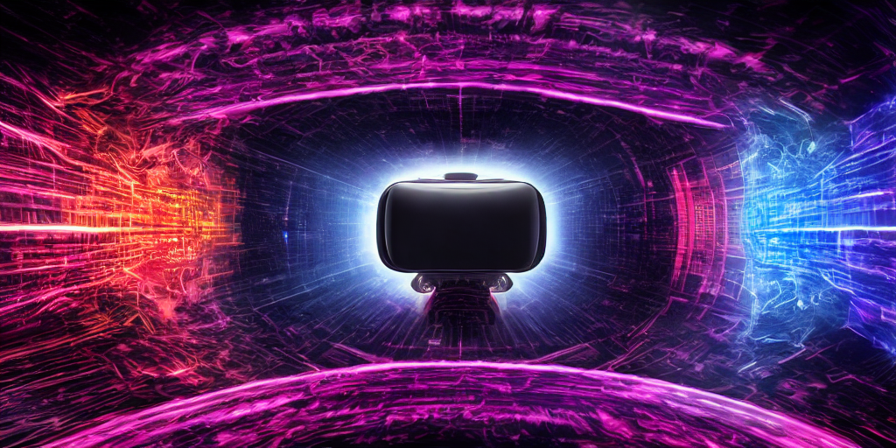

[toc]

## Introduction

What if we can make humans understand multiple dimensions intuitively? To make things easier, let's just work with four spatial dimensions for now.

Note: this is still just a rough idea without much research behind it.

## Simulating 4-D with current technology

- Requires a working virtual 4-dimensional world.
  - see [Miegakure](https://miegakure.com/)
- Show VR to the eyes, but show slightly different images according to 4D perspective.
  - Kind of like pretending to be a deer but in 4-D. You have a separate 4-D interpupillary distance.
  - Need a 4th-dimensional head tracking substitute - maybe wrist rotation for one of the hands?
  - Advanced eye tracking - maybe use eye torsion as eye movement in the 4th dimension. Eye torsion should be trainable [^torsion]
- Use a sensory substitution device for the 4th dimension, such as  the tongue visual sensor
  - Since the tongue sensor is 2-D, you can have 4-D dimensional overlap with what you are seeing with the eyes.
  - Maybe simulate eye movements and focus with tongue movements? Might be easier with a hand touch sensory substitution system, but then you lose some control options.
- Navigation options
  - Using controllers with lots of buttons
    - A joystick for up right left down + 2 adaptive triggers for 4d-forward, 4d-back.
    - Need 2 buttons or motion control for accelerate and decelerate.
  - BCI - would be interesting to see how the neural manifolds change.

## In the far future

- Advanced brain-computer interface (BCI) technology beyond current microarrays.
  - Requires high-bandwidth decoding and microstimulation technology that can adapt to changes in the brain.
- Virtual 4-D sensory organs directly connected to the brain
  - Instead of eyes having a single 2-D plane of photoreceptors, simulate each eye having a 3-D array of photoreceptors, and transmit that to a 3-D block in the visual cortex.
- Navigate using the BCI - I'm 90% confident the motor cortex can learn to control 4-D movement.
  - To make things easier, it would be something like 4-D thruster controls rather than limbs.
- Can try 5-D and higher, and mess with physics, to see what our limits are.

### Applications

- Basically see what the limit of our brain adaptivity is.
  - Investigate the nature vs nurture of physical understanding.
  - Advance research on population neural dynamics and neural manifolds.
- Once comfortable in 4-D what can we create?
  - 4-D sculpture art and other media. Maybe 3-D movies and videos will be more popular.
  - 3-D documents.
  - 4-D games. Ex. surgeon simulator. Access a 3-D body without cutting it open!
  - 4-D education. Imagine the math visualizations you can get!
  - 4-D engineering. Virtual machines that work according to the 4-D physics engine. Could potentially make 3-D engineering easier.
  - Understanding higher-dimensional data at an intuitive level.
    - Ex. Perform dimensionality reduction to 3- or 4-D rather than 2- or 3-D
    - Google Earths. Earth as a hypersphere can show more data at once.
    - Coming back into 3-D will feel like playing a 2-D game.

## Existing research

I have found some research from 2009[^intuition] onwards. As far as I know none have involved sensory substitution or BCIs, but I haven't done a lot of research into the literature yet. This section will be updated if I do.

[^torsion]: Balliet, R. & Nakayama, K. Egocentric orientation is influenced by trained voluntary cyclorotary eye movements. Nature 275, 214–216 (1978).

[^intuition]: Ambinder, M. S., Wang, R. F., Crowell, J. A., Francis, G. K. & Brinkmann, P. Human four-dimensional spatial intuition in virtual reality. Psychonomic bulletin & review 16, 818–823 (2009).